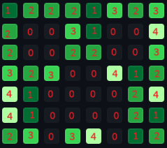

## Welcome to the Creeper in Contribution Graph user profile!

The goal of this user is not to contribute normally, but to draw the face of a Minecraft creeper in the contributions graph.
I've been wanting to do this for a while, but now, I'm actually doing it. The whole process should take about 56 days to complete. I can't mess up once.

If something looks off in the graph, it may be because of your timezone. I'm not sure how timezones are accounted for when viewing the graph, but I'm in the CST timezone. I _usually_ make my contributions between 11 AM and 6 PM CST.

The creeper in my profile pic is roughly what I am going for as my final product, however, that one was made via inspect page. This one will be for real! That image inspired this.

As you may have noticed, a Minecraft creeper face is 8x8, however, a week is only 7 days. To account for this, the top row of pixels is cut off, so it's a 7x8 pixel art instead.
The way I see it though, it just helps to center the face more. It's always bothered me *just a little* that the face is not centered vertically when it could be.

### How I do it

You may be wondering, how am I going to do this perfectly for 56 days straight? Surely I must have created a bot or something to automate making commits? Nope! I'm doing this all manually, which only makes it more impressive, though it doesn't say much for my coding skills. So far, there have been no mess-ups, though one close call. You may need to be in the correct timezone to view the contribution graph properly—I'm not sure if or how it accounts for timezones.

Below is my plan for the final product—my blueprint outlining how many commits are needed for each day.

commit 2/4
